# 电脑配置

## CPU
### R5 5600 散片6核12线程
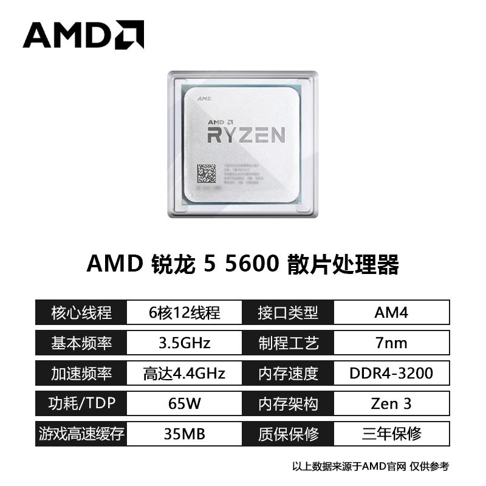

## 主板
### 华硕B550M-PLUS WIFIⅡ
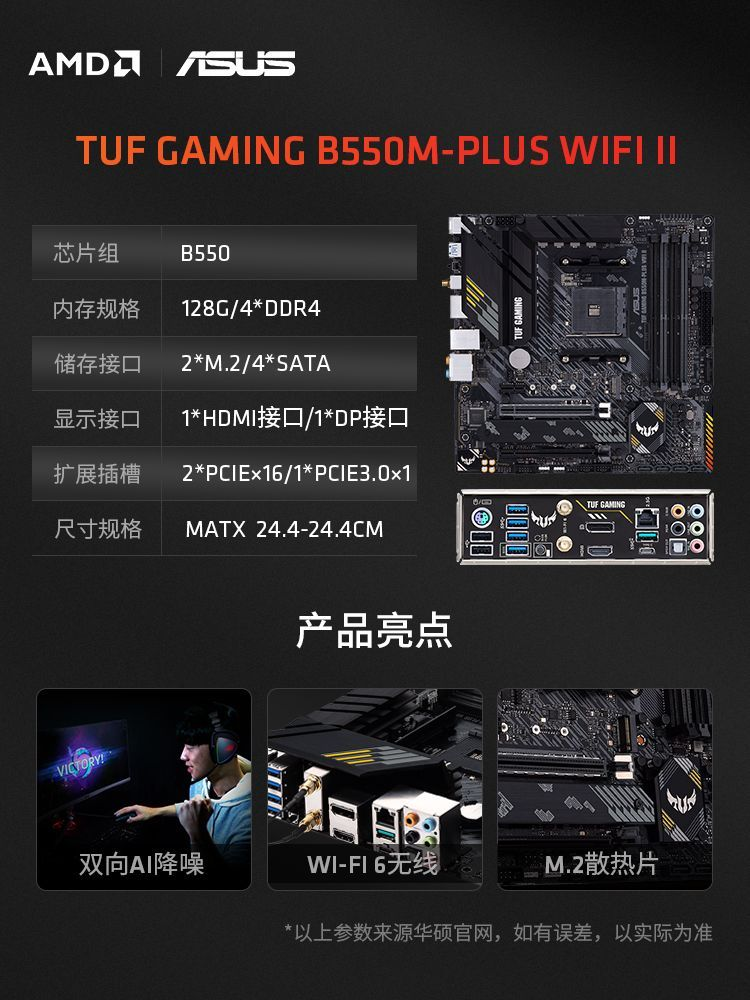

## 显卡
### 盈通RX7600大地之神 8G 165W
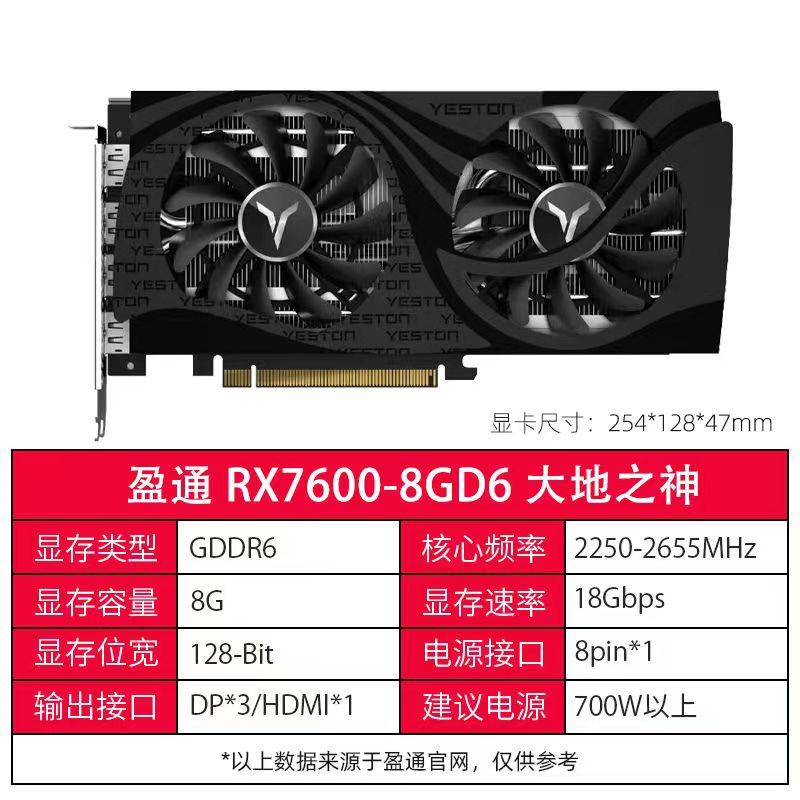

## 主显示器

### 创维F24B33F 24寸 IPS 1K 100HZ

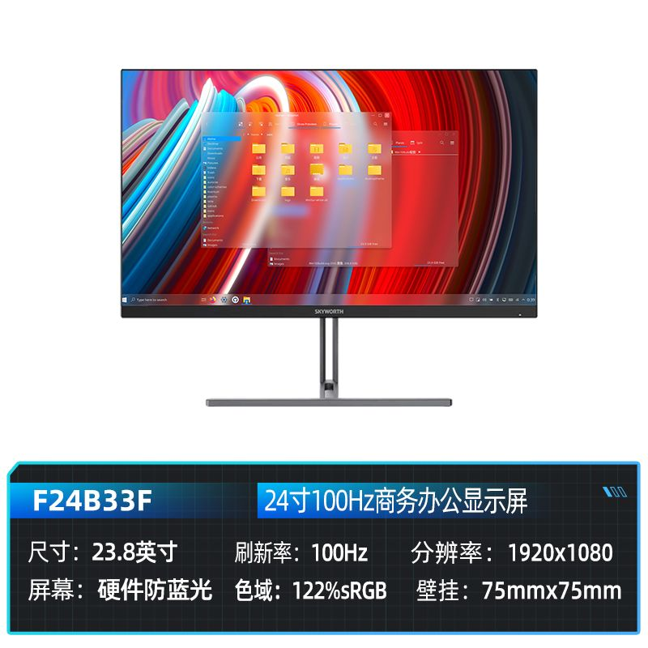

## 副显示器

### 咸鱼 京东方A-屏 15.6寸 IPS 2K 60HZ

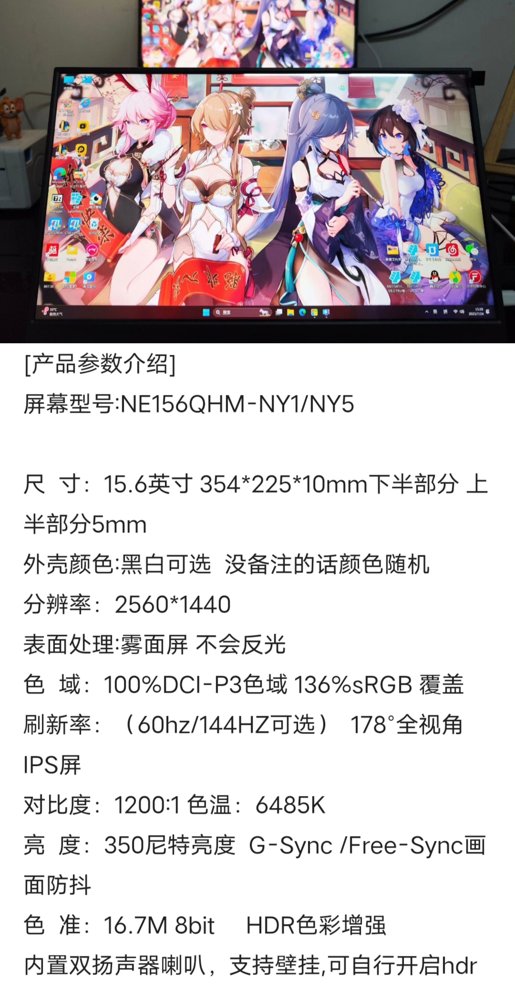

## 内存

### 光威天策DDR4 3200MHZ 16G*2
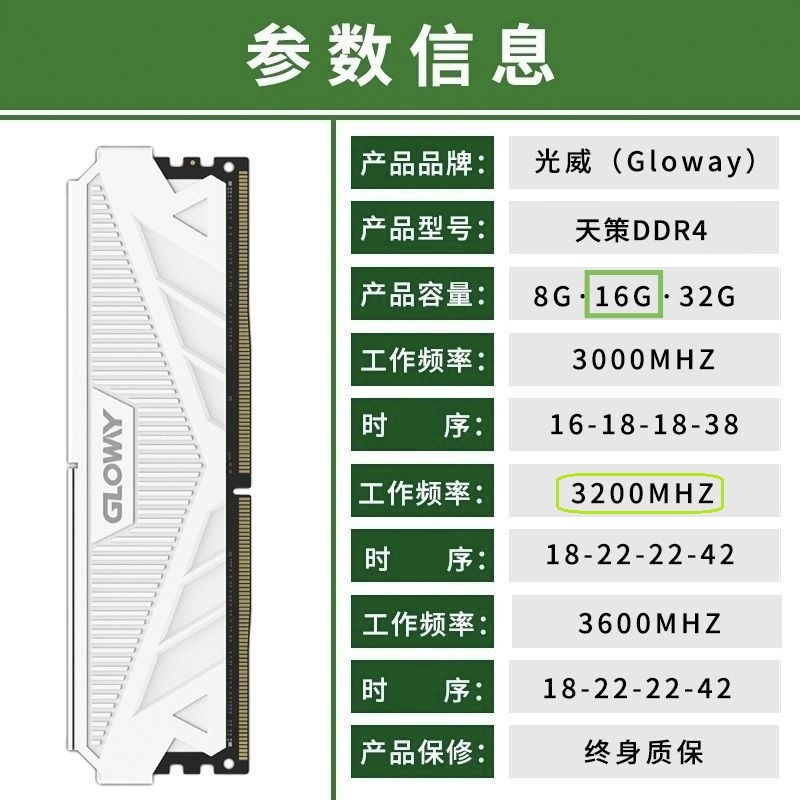

## 储存
### 固德佳GVL 1TB M2 PCIe3*4
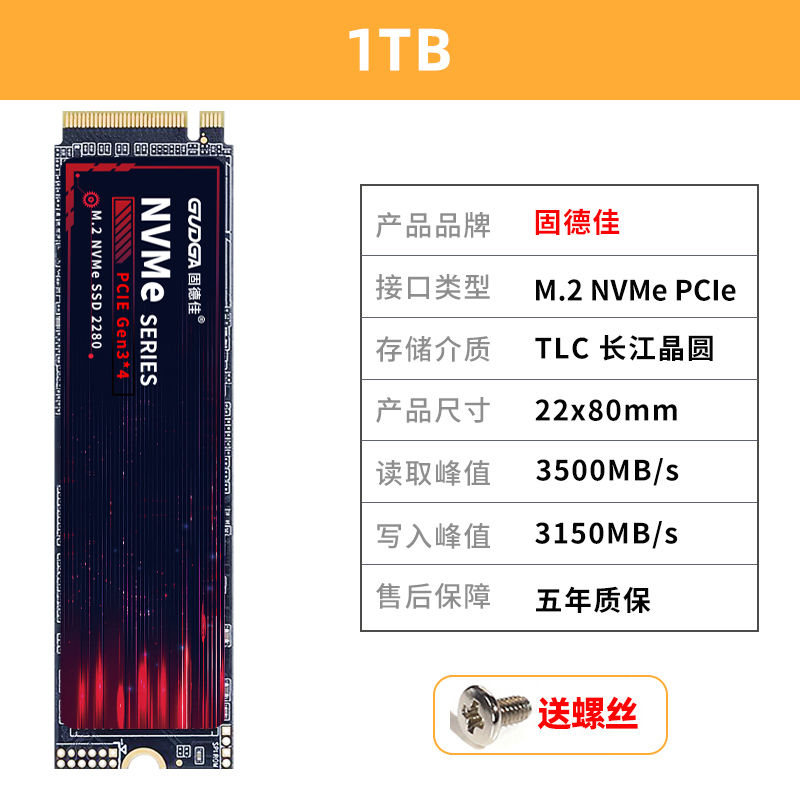

### 长城GW3500 1TB M2 PCIe3*4
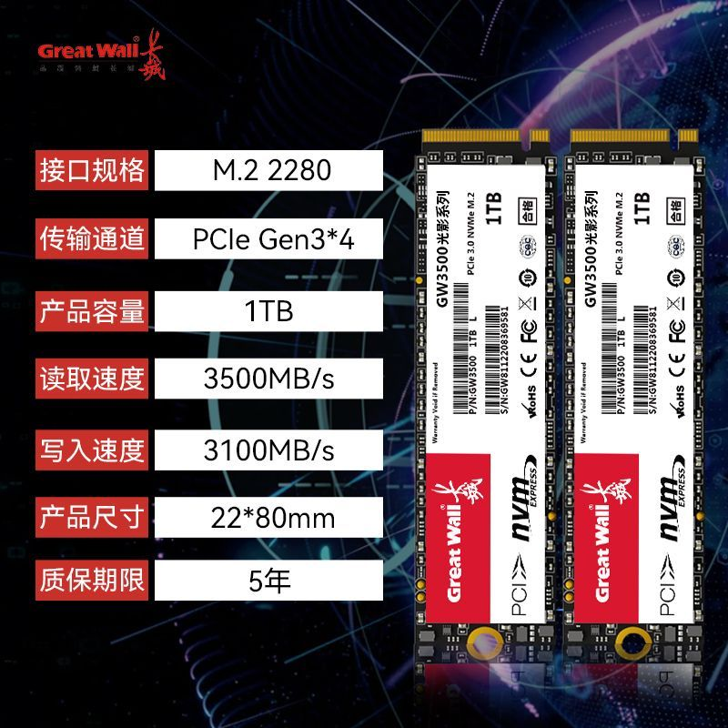

### 长城GT6 黑金系列 1TB SATA3.0
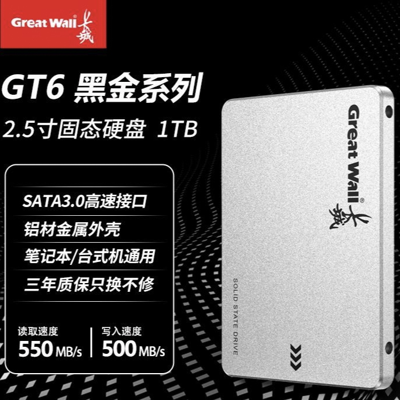

## 电源
### 长城V7 金牌全模组700W
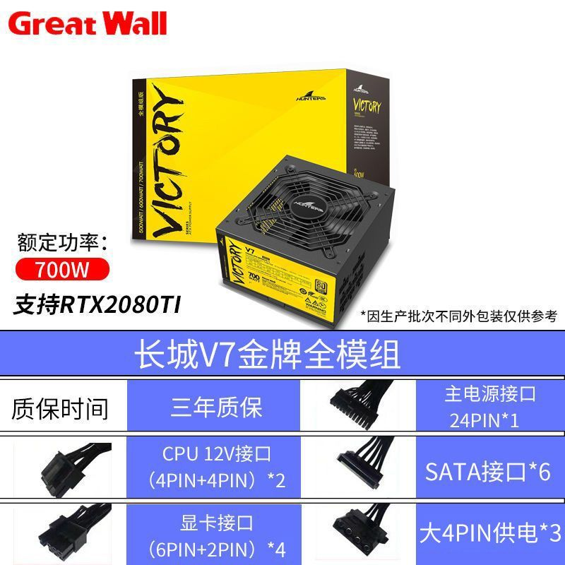

## 机箱
### 笨牛E15 15.5L
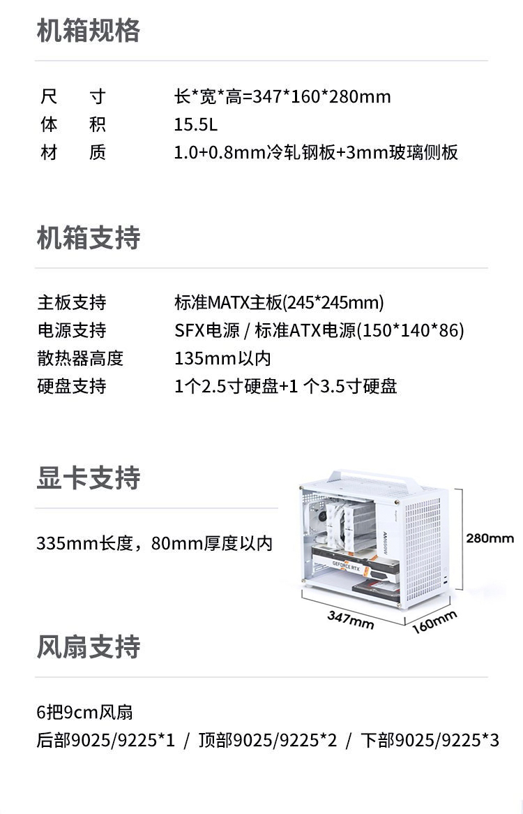

## 散热
### 笨牛BU135 双塔六管PWM温控 800~2000转
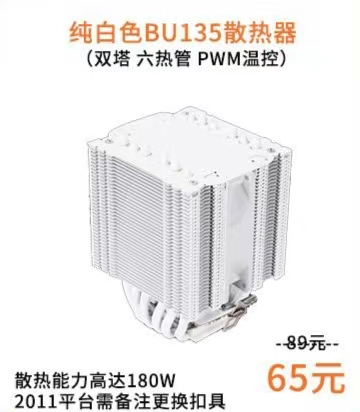

### 鱼巢9215 白-4P温控无光×3 800~2000转
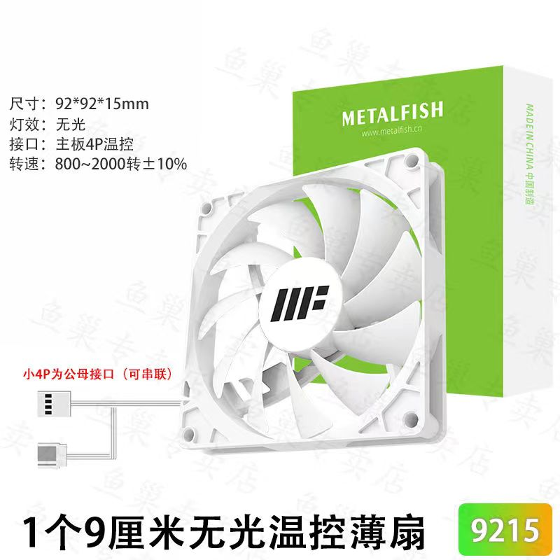

## 价格

|CPU|主板|显卡|内存|固态|电源|机箱|风扇|主显|副显|辅材|==合计==|
|:-:|:-:|:-:|:-:|:-:|:-:|:-:|:-:|:-:|:-:|:-:|:-:|
|663|700|1874|369|249+228|345|164|40|490|283|408|==5813=|
## 功率

|CPU|显卡|主板|==合计==|
|:-:|:-:|:-:|:-:|
|65|170|50|==285==|

## 参考文献

### 中端CPU大乱斗，谁才是性价比之王？
### [UP：天才赵德柱](https://space.bilibili.com/151155077)

<iframe id="video" src="//player.bilibili.com/player.html?aid=315920990&bvid=BV1JP411k7ay&cid=1197592035&page=1&autoplay=0" width="100%" frameborder="0" allowfullscreen="allowfullscreen"></iframe>

